<p align="center">
  
</p>

<p align="center">
  <b>No server · No accounts · No internet access</b>
</p>

# Pen-pal Pet

A small pet lives along the bottom of the Pen-pal Pet window. Hand it a doodle
or a note, and it walks off the edge of the window and onto a friend's
computer, where it waits until they read it. Then it walks home with their
reply.

Notes travel straight from one computer to the other over your Wi-Fi. There is
no server, no account, no sign-up, and nothing to keep running: install the app
on two computers on the same network and you can send notes.

## Download and install

### ➜ **[Download for Windows](https://github.com/JnrDevAmi/Pen_Pal_Pet/releases/latest)**

**Windows only.** There is no macOS or Linux build: the app has never been run
on either, and shipping one would be claiming something nobody has checked.

1. Download the zip and **unzip it**
2. Double-click **`Pen-pal-Pet-Setup-2.0.0.exe`**
3. Windows shows a blue *"Windows protected your PC"* box — click **More info**,
   then **Run anyway**. That appears because the app has no paid code-signing
   certificate; it means the publisher is unverified, not that anything is wrong.
4. **I Agree** → **Next** → choose where to put it → **Install** → **Finish**

The app opens. No administrator password, nothing else to install.

On first run, type your name and pick a pet. Windows asks whether to allow
Pen-pal Pet through the firewall: **say yes, and tick Private networks only.**
Without it the two computers can't hand notes to each other. Never tick Public —
the app has no business listening on a café or airport network.

**Prefer not to install anything?** `Pen-pal-Pet-2.0.0-portable.exe` runs
straight from the file and works from a USB stick. Nothing is installed.

To remove it: **Settings → Apps → Installed apps → Pen-pal Pet → Uninstall**.
Your notes are kept in case you reinstall; delete `%APPDATA%\Pen-pal Pet` to
clear those too.

## Using it

1. On first run, type your name and pick a pet. Your friend does the same on
   their computer.
2. Use the shortcuts down the left: **Write a note**, **Mailbag**, **Add a pen
   pal**, **My pet**. You can also click the pet itself, or the tray icon
   (menu bar on a Mac).
3. **Write a note**: pick whoever is nearby, doodle something, add a few words,
   and hand it to your pet.
4. Your pet dawdles for a moment, then walks off the edge of the window.
5. A few seconds later it walks into your friend's window carrying an envelope.
   They click it, read it, and choose **Write back** or **Just wave back**.
6. Your pet walks back in with a yellow envelope. Click it to read the reply.

Other things worth knowing:

- **Me (test run)** in the "To" list sends a note to yourself, so you can watch
  the whole trip without a second computer — your pet walks off, comes back as
  a visitor, and you can reply to yourself.
- If your friend's computer is asleep, the note **waits in the satchel** and goes
  out by itself as soon as they're back on the Wi-Fi.
- If they never reply, **Call home** in the Mailbag brings your pet back.
- Closing the window leaves the app running in the tray, so notes still arrive.
  Quit properly from the tray menu when you want it to stop.
- The tray menu can start the app at login and stop strangers on the same
  network from sending you notes.

## Safety codes

Open **Nearby friends** and each person shows four words underneath their name —
something like `otter-lantern-brisk-fig`. Both computers work those words out
independently from each other's keys, so they match only if you are really
talking to each other.

Read them aloud once, press **Check**, and that friend gets a ✓. You never have
to do it again, and notes work fine if you skip it — checking only upgrades what
the app can promise from "encrypted" to "encrypted, and definitely them".

If a computer ever claims to be a friend you've already met but its keys don't
match, the app **blocks it and tells you**. Nothing is sent. If your friend
genuinely reinstalled, you can forget them from that warning and meet them
again fresh.

## Privacy and security

- Notes never leave your local network, and no copy is stored anywhere else.
  The app makes no internet connections at all — there is nothing to opt out of.
- **Your identity can't be borrowed.** Your ID is a fingerprint of your own
  signing key, so claiming to be someone else would mean holding their key.
- **Everything is signed.** Every announcement and every note carries an Ed25519
  signature. Anything unsigned, mis-signed, stale or repeated is dropped.
- **Everything is encrypted**, with a key derived per pair of friends (X25519 +
  HKDF, AES-256-GCM). Someone sniffing the Wi-Fi sees nothing readable, and a
  captured message can't be replayed or redirected.
- The app only accepts connections from computers on your own networks, and the
  listener caps connections and times out anything that dawdles.
- **Your keys are sealed on disk** with your operating system's own keystore
  (DPAPI on Windows), so copying
  `identity.json` to another computer yields nothing usable.
- Everything is kept in two small files in the app's own folder: `identity.json`
  and `notes.json`.

What it still doesn't do: **display names aren't unique**. Anyone can call
themselves "Priya" — they simply arrive as a *separate* person with a different
safety code, not as your Priya. Checking the code once is what tells the two
apart.

## Limits

- **Same Wi-Fi only.** Both computers must be on the same network. This is not a
  way to reach a friend across town.
- **The app must be running on both computers** for a note to be handed over.
  It sits in the tray and can start automatically at login.
- Some networks block the discovery messages between devices, usually guest
  Wi-Fi and larger corporate networks with "client isolation" switched on. On
  those, friends won't appear in the list.

## Using this code

No licence is granted. The source is here to read, and to build for yourself if
you want to; it is not offered for redistribution or reuse. If you would like to
do something with it, ask.

## For developers only

Everything below is for changing the app. **If you just want to use it, stop
here** and take the download at the top — you do not need Node, npm, or any of
this.

<details>
<summary>Building from source</summary>

```bash
cd app
npm install
npm start               # run it from source

npm run dist:portable   # single portable .exe, nothing to install
npm run dist            # the setup wizard
```

The Windows installer is built by `electron-builder`. macOS and Linux targets
were removed rather than left in untested: the app still carries a tray icon
and a keystore path for both, so they are plausible, but nobody has built or
run them. Adding them back means building on those machines and actually
checking the window appears, the tray behaves, and the keystore works.

### Publishing a version

Tag it, and GitHub Actions builds all three platforms, runs the tests, and
publishes a release with the installers attached:

```bash
git tag v2.0.0
git push origin v2.0.0
```

The tag is what makes a public download link. Running the workflow by hand
instead puts the files in the run's Artifacts, which is fine for checking a
build but no use to anyone else: those need a GitHub login and expire.

</details>

<details>
<summary>Testing</summary>

### Two peers on one machine

Each copy needs its own identity, which means its own data folder:

```bash
cd app
npm run peer:a      # first window
npm run peer:b      # second window
```

As far as the app is concerned those are separate installs — different keys,
different IDs, real sockets between them — so they discover each other, show
each other's safety codes, and hand notes over exactly as two computers would.
Their data lives in `app/.peers/a` and `app/.peers/b`.

### The suites

The tests drive real peers over real sockets — real UDP multicast, real HTTP,
real key exchange. No Electron needed; they run on plain Node.

```bash
cd app && npm test          # everything, in order
npm run test:stress         # load, flood, churn, bounded memory
npm run test:multiproc      # 30 peers in separate processes
```

`npm test` covers the renderer too, which needs Electron installed. Without
`node_modules` the rest still runs on plain Node and that suite is skipped.

| File | What it proves |
| --- | --- |
| `test/06-units.js` | Sanitisers and crypto primitives |
| `test/07-ipc.js` | The one door from the page into privileged code |
| `test/08-hardening.js` | Sandbox, CSP, permissions, key leakage, build contents |
| `test/00-discovery.js` | Two peers find each other over the network |
| `test/01-roundtrip.js` | Send, deliver, open, reply, return |
| `test/02-edges.js` | Self-send, recall, refusal, offline queueing, restart |
| `test/03-attacks.js` | Forged beacons, replays, tampering, hostile input |
| `test/04-stress.js` | Many peers, note floods, churn, memory bounds |
| `test/09-renderer.js` | The real page: every screen, hostile content, XSS |
| `test/05-multiproc.js` | Realistic scaling, one peer per process |

</details>

<details>
<summary>What's inside</summary>

```
app/
  main.js        the app window, tray menu, app plumbing
  net.js         finding friends on the Wi-Fi and handing notes over
  actions.js     the only things the page may ask the app to do
  crypto.js      identities, signatures, message keys, safety codes
  store.js       the two small files on disk
  preload.js     the narrow bridge between the two halves
  renderer/      the home page, the pets, the paper windows, the doodle pad
test/            real-socket tests, from unit to adversarial
banner.svg       the animated README banner (self-contained, no requests)
```

</details>
